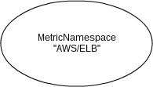
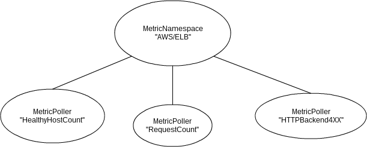
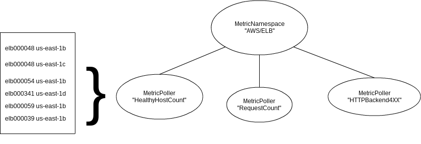
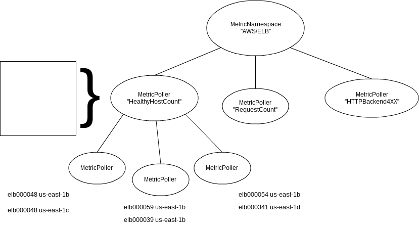
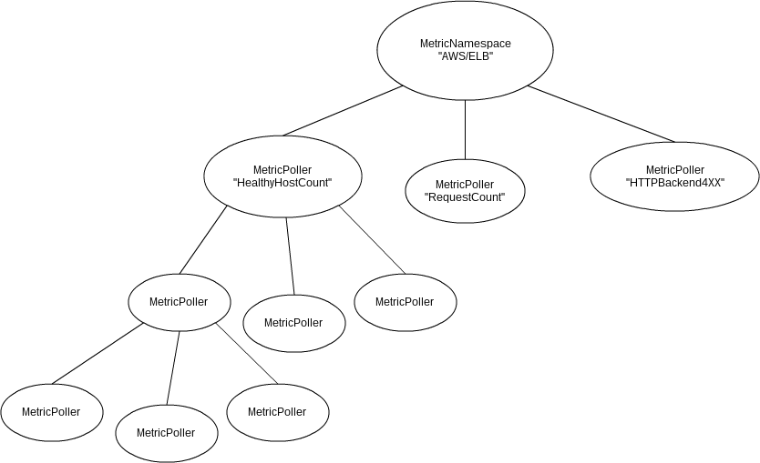

# CloudWatch Metric Collection

# Problem
### ELB Metrics are only available through CloudWatch. How can we get ELB metrics out of CloudWatch and into our own systems?

# CloudWatch Basics
  - Is a metric aggregator, not a collector
  - No push, only pull
  - Minimum granularity of 60 seconds
  - Asking for too much data returns an error
  - Throttled if too many requests per second

# CloudWatch Terms
### Namespace
A service-level metric category like "AWS/ELB".
### Metric
A measurable value like RequestCount or UnhealthyHostCount.
### Dimension
An identifying attribute of a Metric. ELB dimensions are ELB name and
Availability Zone.

# CloudWatch API
### ListMetrics
Returns a filtered list of Metrics including Namespace, Metric name, and Dimensions. 
Each Metric represents one Dimension 'vector'.
### GetMetricStatistics
Given a Namespace, Metric Name, Start Time, End Time, and Granularity, return datapoints that match. Dimensions are optional filters. You can also retrieve aggregate metrics like Sum and Average.

# Gotcha
So can we batch metric requests?

Nope - Datapoints returned do not include dimensions, so we cannot relate them to
the monitored element that generated them unless we add Dimension filters to
the request. Every Dimension vector needs a separate request.

# Challenges
  - Polling efficiently
  - Splitting requests that hit limits
  - Slowing down when we are throttled
  - Ensure that source doesn't outpace sink

# Scaling
### We must be able to retrieve and process all metrics generated in 1 minute in less than a minute.
What if there are 100 ELBs? 1000? 10000?

# Solution
  - Amazon services are designed to scale throughput with concurrency
  - Rely on CloudWatch to scale efficiently as concurrency increases

# Divide and Conquer
  - Split large problems into many smaller problems
  - Scale (divide) automatically in response to load
  - Sense load by measuring poll time

# Possible Solutions
  - Reactor
  - Processes
  - Threads

# Actors
  - A thread abstraction that uses message passing instead of shared state
  - Easier to reason about and use effectively than threads
  - Used in Erlang to create reliable concurrent systems

# Celluloid Hello World
    ::: ruby
    class LazyActor
      include Celluloid

      def hello(s)
        puts "The time is #{Time.now.iso8601}"
        sleep 4
        puts "Also, hello #{s}"
      end
    end

# Celluloid Sync Call
    ::: ruby
    >> 4.times { LazyActor.new.hello("heroku") }
    The time is 2013-01-24T21:44:23-08:00
    Also, hello heroku
    The time is 2013-01-24T21:44:27-08:00
    Also, hello heroku
    The time is 2013-01-24T21:44:31-08:00
    Also, hello heroku
    The time is 2013-01-24T21:44:35-08:00
    Also, hello heroku
    => 4

# Celluloid Async Call
    ::: ruby
    >> 4.times { LazyActor.new.async.hello("heroku") }
    The time is 2013-01-24T21:45:00-08:00
    The time is 2013-01-24T21:45:00-08:00
    The time is 2013-01-24T21:45:00-08:00
    => 4
    >> The time is 2013-01-24T21:45:00-08:00
    Also, hello herokuAlso, hello heroku

    Also, hello heroku
    Also, hello heroku

# Namespaces

# Pollers

# Metrics

# Subpollers

# Why not use async?
  - Not a reactor. Async requests are ultimately still synchronous.
  - The earlier example cheated because sleep is overridden in Celluloid to
    immediately yield to the scheduler and resume after a timeout.

# Polling
    ::: ruby
    def poll
      elapsed = Benchmark.realtime do
        metrics.each do |metric|
          datapoints = metric.advance

          dump(datapoints)
        end
      end

      if elapsed > (period * @split_factor)
        split
      end
    end

# Splitting a poller
    ::: ruby
    # stop polling
    @poll_timer.cancel

    # split metrics into N subgroups
    metric_subgroups = @growth_factor.times.collect { [] }
    @metrics.each_with_index { |e, i| metric_subgroups[i % @growth_factor] << e }

    # assign each subgroup to a subpoller
    @subpollers = metric_subgroups.collect do |subgroup|
      self.class.new_link(@options).tap do |poller|
        subgroup.each { |metric| poller.add_metric(metric) }
      end
    end

    # we don't own these metrics anymore
    @metrics.clear

# Sub-subpollers

# Sharding Metrics
If a single process just isn't keeping up, sharding could help scale.

Use the total number of processes to split up metrics. If there are
4 processes, the 1st process takes metric 1, 5, and 9, the 2nd process takes
2, 6, and 10, and so on.

This requires restarting all processes when the scale changes, or if scale
changes were detectable then the Namespace actors could just crash themselves
and be restarted.

# Handling Request Size Limits
Because we are making one request per Dimension vector, we can't split
requests by dimension, but we can split requests by time slice. 

Make multiple requests per period and join the results.

# Handling Throttling
If we are throttled by CloudWatch, we need to get the same quantity of data
with fewer requests.

Increase the polling interval and get multiple time periods per request (up to
the requests size limit).

# Shrinking
Shrinking is useful because it reduces CloudWatch traffic if load is low.

Splitting pollers is relatively easy, but shrinking is more difficult because
it needs to be recursive.

Pollers could detect whether their children are leaf nodes and only shrink in that case. This could be triggered by summing the polling times of children and comparing them to a minimum time.

# Stateful or Stateless
  - Problem is inherently stateful, so in this case stateless means no
    persistence
  - Stateful services are harder to deploy and manage (but Heroku makes it easier)
  - Can we remain stateless without losing data?

# Why Stateless
  - Easier to write and scale
  - No coordination/locks
  - Scaling easier to control and tune

# Stateless Issues and Solutions
### Crash or Restart
If a process crashes, the position marker is lost.

Assume the position marker was up to date. On start, get the 
previous minute of data first. Most of the time, the process will restart
in less than 60 seconds and no data will be lost (but some will be processed
twice).
### Singletons
If the machine hosting the process dies, there is no other process to take
over.

Automatically restart the process somewhere else. Since there is no state, it can
run anywhere. Use manual backfill if process is down for a long time.

# Demo

# Issues encountered
### Design change to accomodate CloudWatch api
Original design used batched requests, but that wasn't possible with
CloudWatch.
### Celluloid immaturity
Celluloid occasionally got stuck if too many actors crashed at once, or it
received a SIGINT (Control-C) at the wrong time.

# Potential Improvements/Issues
  - Tests
  - Config
  - Backfills
  - Formatting

# Metric Removal
Currently, metrics are only added. If an ELB is terminated, the process would
still poll for it even though it would never get any data.

# Celluloid::IO
A Celluloid::IO-aware client would give each actor its own reactor loop,
allowing multiple in-flight requests per actor.

There isn't a Celluloid::IO-aware http client yet.

# JRuby
MRI is not parallel, but it fakes it reasonably well.

JRuby really is parallel and probably faster for heavily threaded processes.

# Unanswered questions
  - Will it handle production load?
  - Can it catch up if it gets behind?
  - Can the growth logic get into a feedback loop and run out of control?

# Questions?
